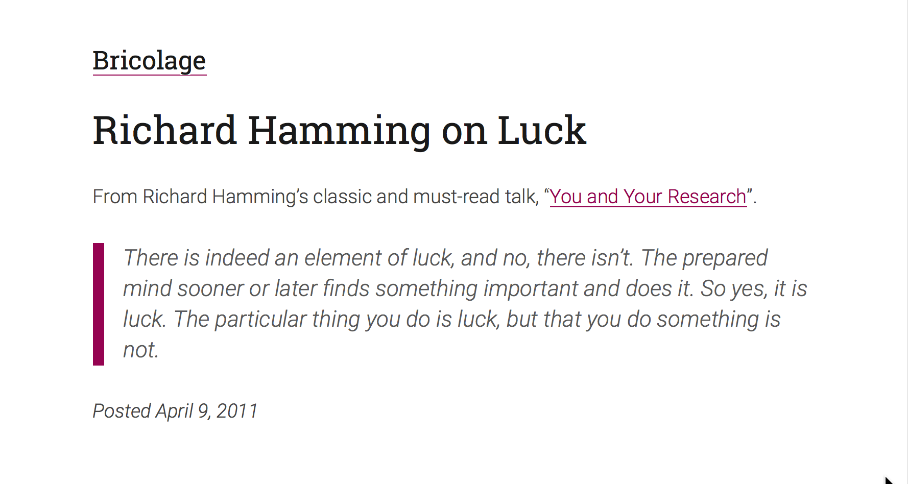

# Ocean Beach — a <a href='https://github.com/kyleamathews/typography.js'>Typography.js</a> theme

A theme for Typography.js

## Install
```bash
npm install --save typography typography-theme-ocean-beach
```
## Usage
```javascript
import Typography from 'typography'
import oceanBeachTheme from 'typography-theme-ocean-beach'

const typography = new Typography(oceanBeachTheme)
```
## More on theme

Ocean Beach uses "Roboto Slab" for headers and "Roboto" for body text


